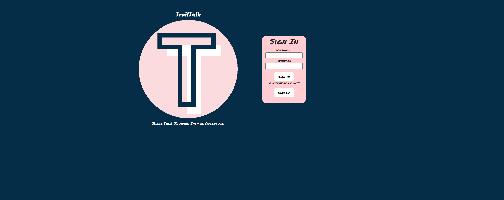
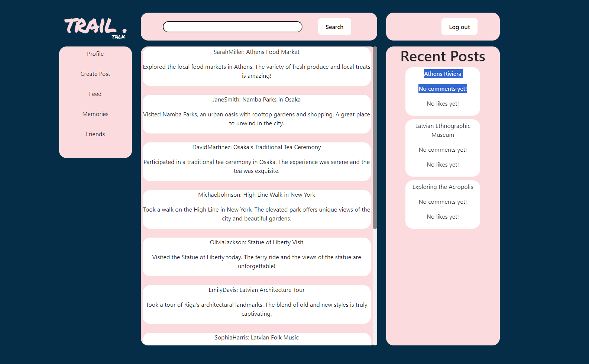
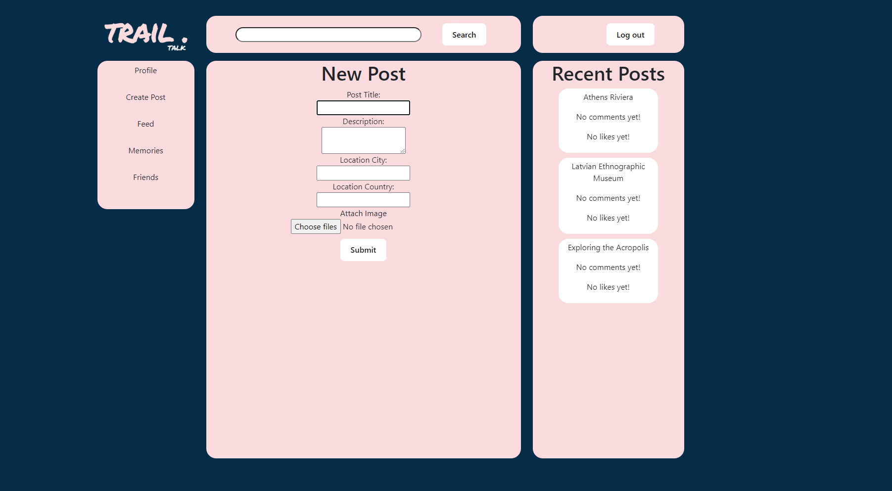
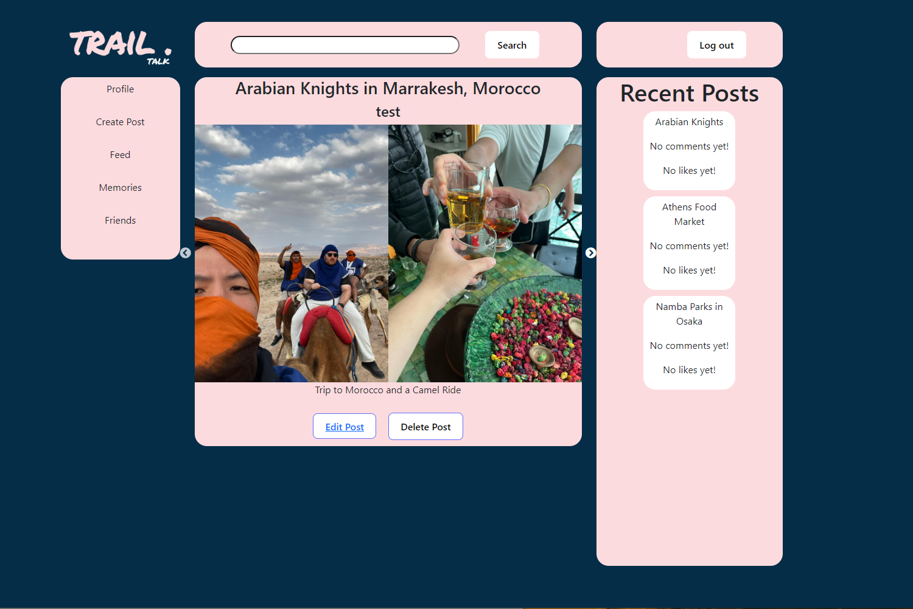

# General Assembly - Trail-Talk PROJECT
Trail-Talk is our travel-focused social media app. Users would sign up, log in, and then create posts (with the option to add pictures) about their recent travel experiences.

## Team
Rahna and Yousef. We completed this project together splitting responsibility during our daily standups. We did pair on portions of this code and then worked individually on others

## Deployed Links

- Rahna - https://trailtalk.netlify.app
- Yousef - https://trail-talkfe.netlify.app

## Project Overview
We were tasked to complete this project using the MERN stack in a week. The technologies of MERN are MongoDB, Express, React and Node. We aimed to create a single-page application(SPA) that would support user creation and authentication and have full CRUD capabilities. We were responsible for building two code bases, the Front-End which users would interact with and the Back-End API.

## Project Planning
Planning Link - https://trello.com/b/SZoZx2rv/ga-seb81-project-3

- Day -1 & -2 (Weekend)
    - Paired to complete the back-end API
- Day 1 (Monday)
    - Built out the Auth Services and the general data retrieval Services
- Day 2 (Tuesday)
    - Built the log-in/sign-up, log-out, nav bar, feed and infinite scroll components
- Day 3 (Wednesday)
    - Built the Create post, right nav, image carousel, show post and search (non-functioning) components and started styling
- Day 4 (Thursday)
    - Focused on styling and fixing bugs

## Technologies

### CSS
    - How to style at a component and global level in React

### JavaScript
    - Node: We used Node and Express to built our back-end API that retrieved data from our database
    - React: We used React to build the Front-End, implementing components (with embedded HTML) and hooks to display the UI and statechanges

### MongoDB
    - Used this non-relational database to store a range of data types

## Site States
Login Page

Index

Create Post

Show Post

## Take Aways
Overall it was a interesting project, seeing and learning how API's and Front-End interact. It provided a range of challenges that could be solved with your partner rather than relying on tutors. Learning to program together really highlighted the importance of following Git’s committing/merging procedures with care. 

### Learnings
    - The importance of proper planning and communication when working in a group. This can be used to avoid alot of conflict issues that came with GIT and working on the same repo
    - How to build an API and connect to it from the Front-End
    - How to build custom and prebuilt components in React, and reading React documention to solve issues with implementing prebuilt components
    - Positional styling with Bootstrap

### Challenges
    - Biggest issue we faced was working with Git as a group. There was a lot of time lost to merge conflicts and rolebacks

### Improvements
    - To implement a search bar that allows users to filter posts based on destination or a specific user, and to autosuggest search terms on typing 
    - To create a profile for each user, which would allow them to view their own posts/likes in one place as well as visit another user’s profile 
    - Implement a dark/light mode
    - Add a ‘friend’ and ‘follow’ feature for users
    - Implement a second dashboard that has posts only from friends and followed users
 
### Bugs
    - The only current known bug is JSON object error messages not displaying properly
